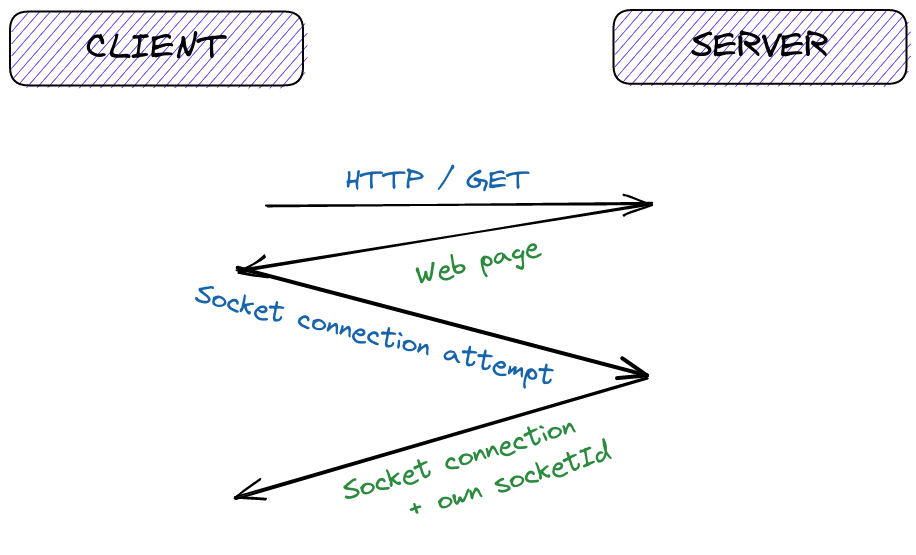
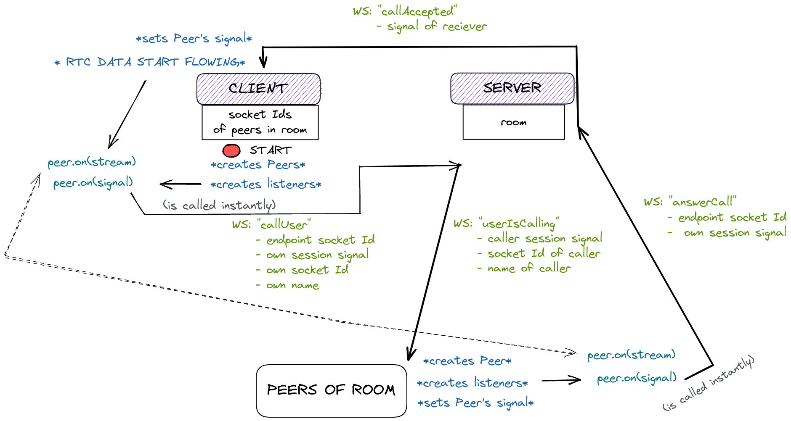

# Meetup

A simple P2P secure video conferencing app.


<div align="center">
	
</div>

## The stack
* React
	- Chakra UI (UI library)
* simple-peer (implementation for WebRTC)
* express (web framework)
* socket.io (WebSocket-like abstraction above HTTP)

## How it works

Well first of all you load the webpage and after that a socket connection between you and the server gets established.

<div align="center">
	
</div>

What you can do afterwards is create a room. That is trivial enough, just do it through the UI and then send your friend the room UUID (and tell them the password, if you have set one). More interesting is how a person connects to a room. **Meetup**, as has been said, does not recieve any data relating to the call, it just merely helps the people "find each other". It looks somewhat like this:

Whenever a user wants to connect they first provide credentials, etc. and if they are valid, the user gets all of the socket IDs of the people in that room.

<div align="center">
	
</div>

Then the actual peer-to-peer connection can get established.

<div align="center">
	
</div>

## Run yourself

1. Clone the repo
```bash
git clone https://github.com/dynamo58/meetup
cd meetup
```

2. Install dependencies & run server
```bash
cd server
npm i
npm run dev
```

3. Install dependencies & run client
```bash
cd client
npm i
npm run dev
```
